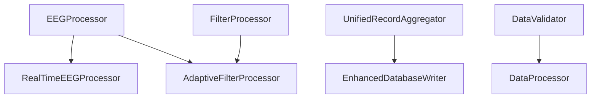
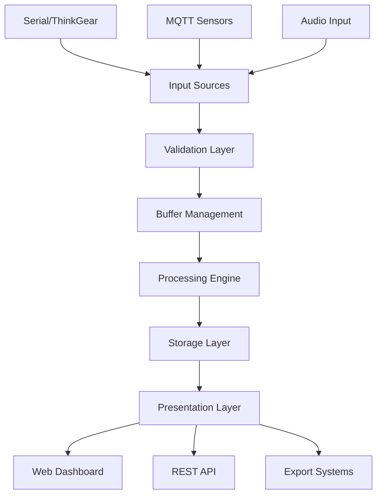

# EEG Dashboard Project - Architecture & Design Patterns

> **Documentation Version**: 1.0  
> **Last Updated**: 2025-01-24  
> **Target Audience**: Development Team, System Architects, New Contributors  
> **Project**: EEG_dash_app - Real-time EEG monitoring dashboard

---

## Table of Contents

- [1. Executive Summary](#1-executive-summary)
- [2. Physical Architecture Model](#2-physical-architecture-model)
- [3. Class Inheritance Model](#3-class-inheritance-model)
- [4. Design Patterns Implementation](#4-design-patterns-implementation)
- [5. Naming Conventions](#5-naming-conventions)
- [6. Data Flow Architecture](#6-data-flow-architecture)
- [7. Extension Points & Future Development](#7-extension-points--future-development)
- [8. Common Pitfalls & Best Practices](#8-common-pitfalls--best-practices)
- [9. Quick Start Guide for New Developers](#9-quick-start-guide-for-new-developers)

---

## 1. Executive Summary

### Project Purpose
Real-time EEG (Electroencephalography) monitoring system with web-based dashboard, designed for neuroscience research and clinical applications. The system processes brain wave signals in real-time, extracts cognitive metrics (attention, meditation), and provides comprehensive data visualization and recording capabilities.

### Key Technical Characteristics
- **Architecture**: Modular, event-driven system with clear separation of concerns
- **Performance**: Numba JIT optimization for signal processing, multi-threading for I/O operations
- **Scalability**: Plugin-ready architecture with well-defined extension points
- **Data Flow**: Multi-layer pipeline with real-time processing and persistent storage
- **UI Framework**: Dash (Plotly) for interactive web interface with REST API backend

### Core Design Philosophy
**"Evidence-based, modular design with performance optimization and extensibility"**

---

## 2. Physical Architecture Model

### Directory Structure Rationale
```
dash_eeg_app2/
├── src/main/
│   ├── python/              # Core application layer
│   │   ├── api/            # REST API endpoints (Flask)
│   │   ├── core/           # Signal processing engine
│   │   ├── models/         # Data structures & state management
│   │   ├── services/       # External system integration
│   │   ├── ui/             # Web interface components (Dash)
│   │   └── utils/          # Cross-cutting utilities
│   └── resources/
│       ├── config/         # Configuration management
│       └── assets/         # Static resources
├── src/test/               # Testing framework
├── docs/                   # Technical documentation
├── examples/               # Legacy code isolation
└── tools/                  # Development utilities
```

**Design Rationale:**
- **Maven-like structure**: Industry standard for maintainability
- **Clear boundaries**: Each directory has a single, well-defined responsibility
- **Testability**: Separate test infrastructure with parallel structure
- **Legacy isolation**: Old code preserved but separated from active development

---

## 3. Class Inheritance Model

### 3.1 Processing Engine Hierarchy



#### Core Processing Classes

**1. EEGProcessor (Abstract Base)**
```python
class EEGProcessor:
    """Base class for EEG signal processing algorithms"""
    
    def __init__(self, sample_rate=512, window_size=1024):
        self.sample_rate = sample_rate
        self.window_size = window_size
        self.initialized = False
    
    def process_signal(self, data: np.ndarray) -> Dict[str, Any]:
        """Template method - must be implemented by subclasses"""
        raise NotImplementedError
    
    def extract_bands(self, fft_data: np.ndarray) -> Dict[str, float]:
        """Common frequency band extraction logic"""
        # Shared implementation across all processors
```

**Inheritance Benefits:**
- **Code Reuse**: Common signal processing algorithms shared across implementations
- **Polymorphism**: Different processors can be swapped without changing client code
- **Template Method Pattern**: Ensures consistent processing pipeline while allowing customization

**Extension Strategy:**
```python
# Adding new processor types
class WaveletEEGProcessor(EEGProcessor):
    """Custom processor using wavelet transform"""
    
    def process_signal(self, data: np.ndarray) -> Dict[str, Any]:
        # Custom wavelet-based processing
        result = self.apply_wavelet_transform(data)
        return self.format_output(result)
```

**Potential Risks & Mitigation:**
- **Over-inheritance**: Keep hierarchy shallow (max 3 levels)
- **Tight coupling**: Use composition for complex relationships
- **Performance**: Abstract methods add minimal overhead with proper design

#### Data Management Hierarchy

**2. EnhancedCircularBuffer (Composition over Inheritance)**
```python
class EnhancedCircularBuffer:
    """Thread-safe circular buffer with multi-type data support"""
    
    def __init__(self, size: int = 10000):
        self.buffer = np.zeros((size, 1), dtype=np.float32)
        self.timestamps = np.zeros(size, dtype=np.float64)
        self._lock = threading.Lock()  # Thread safety
        self._cognitive_data = CognitiveDataManager()  # Composition
        self._sensor_data = SensorDataManager()        # Composition
        self._asic_data = ASICDataManager()            # Composition
```

**Design Rationale:**
- **Composition over Inheritance**: Multiple data types managed as components
- **Thread Safety**: Explicit locking for concurrent access
- **Memory Efficiency**: Pre-allocated numpy arrays for performance

### 3.2 Service Layer Architecture

**3. Service Layer Pattern Implementation**
```python
# Base service interface
class ServiceBase(ABC):
    """Abstract base for all services"""
    
    @abstractmethod
    def start(self) -> bool:
        """Start service operations"""
        pass
    
    @abstractmethod
    def stop(self) -> bool:
        """Stop service operations"""
        pass
    
    @abstractmethod
    def get_status(self) -> Dict[str, Any]:
        """Get current service status"""
        pass

# Concrete implementations
class DatabaseService(ServiceBase):
    """Database operations with connection management"""
    
class MQTTService(ServiceBase):
    """MQTT communication with topic management"""
    
class AudioService(ServiceBase):
    """Audio recording with device management"""
```

**Extension Example:**
```python
class BluetoothService(ServiceBase):
    """New service for Bluetooth EEG devices"""
    
    def start(self) -> bool:
        # Bluetooth device discovery and connection
        return self.connect_to_device()
    
    def stop(self) -> bool:
        # Clean disconnection
        return self.disconnect_device()
```

---

## 4. Design Patterns Implementation

### 4.1 Facade Pattern - System Coordination

**Implementation: EEGApplication Class**
```python
class EEGApplication:
    """Main application facade coordinating all subsystems"""
    
    def __init__(self):
        # Initialize all major components
        self.data_buffer = EnhancedCircularBuffer()
        self.db_writer = EnhancedDatabaseWriter(database_path)
        self.processor = RealTimeEEGProcessor()
        self.mqtt_client = MQTTSensorClient()
        self.audio_recorder = AudioRecorder()
        self.dash_app = EEGDashboardApp()
    
    def start_application(self):
        """Single method to start entire system"""
        self.db_writer.start()
        self.mqtt_client.start()
        self.processor.initialize()
        self.dash_app.run()
```

**Why Facade Pattern?**
- **Simplicity**: Single entry point for complex system
- **Dependency Management**: Centralized component initialization
- **Error Handling**: Unified error recovery mechanisms
- **Testing**: Easy to mock entire system for unit tests

**Extension Point:**
```python
# Adding new subsystems
def add_subsystem(self, subsystem: ServiceBase):
    """Plugin mechanism for new services"""
    self.subsystems.append(subsystem)
    if self.running:
        subsystem.start()
```

### 4.2 Observer Pattern - Real-time Updates

**Implementation: MQTT + Dash Callbacks**
```python
class MQTTSensorClient:
    """Publisher for sensor data updates"""
    
    def __init__(self):
        self.observers = []  # List of observer callbacks
    
    def add_observer(self, callback: Callable):
        """Subscribe to sensor updates"""
        self.observers.append(callback)
    
    def notify_observers(self, data: Dict[str, Any]):
        """Notify all observers of new data"""
        for callback in self.observers:
            try:
                callback(data)
            except Exception as e:
                logger.error(f"Observer error: {e}")

# Observer implementation
@app.callback(Output("sensor-display", "children"), Input("interval", "n_intervals"))
def update_sensor_display(n):
    """UI observer for sensor data changes"""
    return create_sensor_display(get_latest_sensor_data())
```

**Benefits:**
- **Loose Coupling**: Data sources don't know about UI components
- **Scalability**: Easy to add new observers (WebSocket, mobile app, etc.)
- **Error Isolation**: Observer failures don't affect data collection

### 4.3 Strategy Pattern - Configurable Processing

**Implementation: Filter Selection**
```python
class FilterStrategy(ABC):
    """Abstract filter strategy"""
    
    @abstractmethod
    def apply_filter(self, data: np.ndarray) -> np.ndarray:
        pass

class ButterworthFilter(FilterStrategy):
    """Butterworth filter implementation"""
    
    def apply_filter(self, data: np.ndarray) -> np.ndarray:
        return scipy.signal.filtfilt(self.sos, data)

class AdaptiveFilterProcessor:
    """Context class using strategy pattern"""
    
    def __init__(self, filter_strategy: FilterStrategy):
        self.filter_strategy = filter_strategy
    
    def set_filter_strategy(self, strategy: FilterStrategy):
        """Runtime strategy switching"""
        self.filter_strategy = strategy
```

**Real-world Usage:**
```python
# Platform-specific optimization
if platform.machine() == 'aarch64':  # Raspberry Pi
    processor.set_filter_strategy(OptimizedARMFilter())
else:  # Desktop
    processor.set_filter_strategy(NumbaButterworthFilter())
```

### 4.4 Factory Pattern - Configuration-Based Creation

**Implementation: Component Factory**
```python
class ComponentFactory:
    """Factory for creating configured components"""
    
    @staticmethod
    def create_processor(config: Dict[str, Any]) -> EEGProcessor:
        """Create processor based on configuration"""
        processor_type = config.get('type', 'realtime')
        
        if processor_type == 'realtime':
            return RealTimeEEGProcessor(
                sample_rate=config.get('sample_rate', 512),
                window_size=config.get('window_size', 1024)
            )
        elif processor_type == 'batch':
            return BatchEEGProcessor(
                batch_size=config.get('batch_size', 5000)
            )
        else:
            raise ValueError(f"Unknown processor type: {processor_type}")
    
    @staticmethod
    def create_database_writer(config: Dict[str, Any]) -> EnhancedDatabaseWriter:
        """Create database writer with configuration"""
        return EnhancedDatabaseWriter(
            database_path=config['database_path'],
            max_buffer_size=config.get('buffer_size', 1000),
            flush_interval=config.get('flush_interval', 1.0)
        )
```

### 4.5 Template Method Pattern - Processing Pipeline

**Implementation: Standard Processing Workflow**
```python
class ProcessingPipeline:
    """Template method for EEG processing workflow"""
    
    def process_data(self, raw_data: np.ndarray) -> Dict[str, Any]:
        """Template method defining processing steps"""
        
        # Step 1: Validation (hook method)
        if not self.validate_input(raw_data):
            return self.handle_invalid_input()
        
        # Step 2: Preprocessing (hook method)
        cleaned_data = self.preprocess_data(raw_data)
        
        # Step 3: Feature extraction (hook method)
        features = self.extract_features(cleaned_data)
        
        # Step 4: Post-processing (hook method)
        result = self.postprocess_results(features)
        
        return result  # Common final step
    
    # Hook methods for customization
    def validate_input(self, data: np.ndarray) -> bool:
        """Override in subclasses for custom validation"""
        return len(data) > 0
    
    def preprocess_data(self, data: np.ndarray) -> np.ndarray:
        """Override for custom preprocessing"""
        return data
    
    def extract_features(self, data: np.ndarray) -> Dict[str, Any]:
        """Must be implemented by subclasses"""
        raise NotImplementedError
```

---

## 5. Naming Conventions

### 5.1 Comprehensive Naming Standards

#### File and Directory Naming
```
Pattern: snake_case for files, lowercase for directories
Examples:
  ✓ eeg_processor.py          # Core processing module
  ✓ database_service.py       # Service layer module
  ✓ session_history_page.py   # UI component module
  ✓ audio_config.py           # Configuration module
  
Directories:
  ✓ core/                     # Descriptive, single word
  ✓ services/                 # Plural noun for collections
  ✓ ui/                       # Abbreviation when universally understood
```

#### Class Naming (PascalCase)
```python
# Pattern: [Purpose][Implementation/Type]
class RealTimeEEGProcessor:     # Purpose + Implementation
class EnhancedCircularBuffer:   # Quality + DataStructure  
class UnifiedRecordAggregator:  # Strategy + Purpose
class MQTTSensorClient:         # Protocol + EntityType

# Avoid generic names
❌ class Manager              # Too generic
❌ class Helper               # Doesn't describe purpose
❌ class Utility              # Vague responsibility
```

#### Method Naming (snake_case)
```python
# Pattern: [verb]_[noun] or [verb]_[adjective]_[noun]
def add_cognitive_data(self, attention: float, meditation: float)
def process_current_window(self) -> Dict[str, Any]
def get_latest_sensor_readings(self) -> Dict[str, float]
def start_experiment_session(self, subject_id: str) -> str
def flush_aggregated_records(self) -> int

# Boolean methods use is_/has_/can_ prefix
def is_recording_active(self) -> bool
def has_valid_data(self) -> bool
def can_process_signal(self) -> bool
```

#### Variable Naming
```python
# Pattern: descriptive nouns, avoid abbreviations except when standard
sample_rate = 512                    # Clear technical term
window_size = 1024                   # Standard in signal processing
cognitive_data = {...}               # Domain-specific term
db_writer = EnhancedDatabaseWriter() # Acceptable abbreviation (db = database)

# Arrays and collections use plural
voltage_samples = np.array([...])
sensor_readings = [...]
frequency_bands = {'delta': ..., 'theta': ...}

# Avoid single letters except for common mathematical contexts
for i, sample in enumerate(voltage_samples):  # ✓ Standard loop
x, y = coordinates                            # ✓ Mathematical convention
n = len(data)                                # ✓ Standard count variable
```

#### Configuration Constants
```python
# Pattern: UPPER_CASE with logical grouping
PROCESSING_CONFIG = {
    'SAMPLE_RATE': 512,
    'WINDOW_SIZE': 1024,
    'OVERLAP_RATIO': 0.5
}

MQTT_TOPICS = {
    'SENSOR_DATA': 'eeg/sensor_data',
    'COMMANDS': 'eeg/commands',
    'STATUS': 'eeg/status'
}

# Database schema
TABLE_NAMES = {
    'SESSIONS': 'experiment_sessions',
    'RECORDS': 'unified_records',
    'SUBJECTS': 'subjects'
}
```

### 5.2 Domain-Specific Conventions

#### EEG Signal Processing Terms
```python
# Frequency bands (standardized neuroscience terms)
FREQUENCY_BANDS = {
    'delta': (0.5, 4),      # Deep sleep waves
    'theta': (4, 8),        # REM sleep, creativity
    'alpha': (8, 12),       # Relaxed awareness
    'beta': (12, 30),       # Active thinking
    'gamma': (30, 50)       # High-level cognition
}

# Cognitive metrics (NeuroSky standard terms)
attention_level = 85        # 0-100 scale
meditation_level = 42       # 0-100 scale  
signal_quality = 50         # 0-200 scale (0 = best)
```

#### Database Naming Conventions
```sql
-- Table naming: plural nouns, snake_case
CREATE TABLE experiment_sessions (...);
CREATE TABLE unified_records (...);
CREATE TABLE recording_files (...);

-- Column naming: descriptive, avoid abbreviations
CREATE TABLE experiment_sessions (
    session_id TEXT PRIMARY KEY,           -- Clear identifier
    subject_id TEXT NOT NULL,              -- FK reference
    start_timestamp REAL NOT NULL,         -- Explicit time reference
    researcher_name TEXT,                  -- Human-readable field
    ambient_sound_id INTEGER               -- FK with clear reference
);
```

### 5.3 Collaboration Rules

#### Namespace Management
```python
# Module-level prefixes for potential conflicts
from core.eeg_processor import EEGProcessor
from ui.eeg_dashboard import EEGDashboard

# Class naming prevents conflicts
class CoreEEGProcessor:      # ✓ Module-specific prefix when needed
class UIEEGDashboard:        # ✓ Clear module association

# Avoid conflicts with Python builtins
eeg_filter = ...             # ✓ Not 'filter'
eeg_input = ...              # ✓ Not 'input'  
data_type = ...              # ✓ Not 'type'
```

#### Version Control Naming
```bash
# Branch naming
feature/add-bluetooth-support           # Feature branches
bugfix/fix-session-startup-issue       # Bug fixes
hotfix/critical-memory-leak            # Critical fixes
docs/update-architecture-guide         # Documentation updates

# Commit message format
feat: Add Bluetooth EEG device support
fix: Resolve session startup callback conflict
docs: Update architecture patterns documentation
perf: Optimize Numba JIT compilation for ARM64
```

---

## 6. Data Flow Architecture

### 6.1 High-Level Data Flow Overview



### 6.2 Detailed Data Flow Analysis

#### Layer 1: Input Sources
```python
# Multiple data ingestion paths
class DataIngestionManager:
    """Coordinates multiple input sources"""
    
    def __init__(self):
        self.serial_service = SerialService()      # EEG hardware
        self.mqtt_client = MQTTSensorClient()      # Environmental sensors  
        self.audio_recorder = AudioRecorder()      # Audio capture
        
    def start_data_collection(self):
        """Start all input streams concurrently"""
        threading.Thread(target=self.serial_service.start_reading).start()
        self.mqtt_client.connect_and_subscribe()
        # Audio starts on-demand via UI
```

**Data Sources Detail:**
- **Serial/ThinkGear**: Raw EEG voltages (512 Hz), ASIC band powers, attention/meditation
- **MQTT Sensors**: Temperature, humidity, light levels (1 Hz updates)
- **Audio Input**: PCM audio streams (44.1 kHz) for environmental recording

#### Layer 2: Data Validation
```python
class DataValidator:
    """Comprehensive data validation with error recovery"""
    
    def validate_eeg_sample(self, sample: Dict[str, Any]) -> ValidationResult:
        """Multi-level EEG data validation"""
        errors = []
        
        # Type validation
        if not isinstance(sample.get('voltage'), (int, float)):
            errors.append("Invalid voltage type")
            
        # Range validation  
        voltage = sample.get('voltage', 0)
        if not (-1000 <= voltage <= 1000):  # Typical EEG range in microvolts
            errors.append(f"Voltage out of range: {voltage}")
            
        # Signal quality check
        quality = sample.get('signal_quality', 200)
        if quality > 100:  # NeuroSky scale: 0=best, 200=worst
            errors.append(f"Poor signal quality: {quality}")
            
        return ValidationResult(valid=len(errors)==0, errors=errors)
    
    def validate_sensor_data(self, data: Dict[str, float]) -> ValidationResult:
        """Environmental sensor validation"""
        # Temperature: reasonable indoor range
        temp = data.get('temperature', 0)
        if not (10 <= temp <= 40):  # Celsius
            return ValidationResult(False, [f"Temperature out of range: {temp}°C"])
            
        # Humidity: 0-100% range
        humidity = data.get('humidity', 0)
        if not (0 <= humidity <= 100):
            return ValidationResult(False, [f"Humidity out of range: {humidity}%"])
            
        return ValidationResult(True, [])
```

#### Layer 3: Buffer Management
```python
class EnhancedCircularBuffer:
    """Thread-safe multi-type data buffer with intelligent management"""
    
    def __init__(self, size: int = 10000):
        self.raw_buffer = np.zeros((size, 1), dtype=np.float32)
        self.timestamps = np.zeros(size, dtype=np.float64)
        self.write_index = 0
        self.buffer_full = False
        self._lock = threading.Lock()
        
        # Specialized data managers (composition pattern)
        self.cognitive_manager = CognitiveDataManager()
        self.sensor_manager = SensorDataManager()
        self.asic_manager = ASICDataManager()
        self.blink_manager = BlinkDataManager()
    
    def add_eeg_sample(self, voltage: float, timestamp: float, 
                       cognitive_data: Optional[Dict] = None):
        """Thread-safe sample addition with overflow handling"""
        with self._lock:
            # Add to circular buffer
            self.raw_buffer[self.write_index, 0] = voltage
            self.timestamps[self.write_index] = timestamp
            
            # Update cognitive data if available
            if cognitive_data:
                self.cognitive_manager.update(
                    attention=cognitive_data.get('attention'),
                    meditation=cognitive_data.get('meditation'),
                    signal_quality=cognitive_data.get('signal_quality'),
                    timestamp=timestamp
                )
            
            # Advance write pointer
            self.write_index = (self.write_index + 1) % self.size
            if self.write_index == 0:
                self.buffer_full = True
```

**Buffer Management Strategy:**
- **Circular Buffer**: Fixed memory footprint, automatic overflow handling
- **Thread Safety**: Explicit locking for concurrent access
- **Data Partitioning**: Separate managers for different data types
- **Memory Efficiency**: NumPy arrays for numerical data, optimized data structures

#### Layer 4: Processing Engine
```python
class RealTimeEEGProcessor:
    """Real-time signal processing with Numba optimization"""
    
    def process_current_window(self) -> Dict[str, Any]:
        """Main processing pipeline"""
        
        # Step 1: Get current data window
        raw_data, timestamps = self.data_buffer.get_data()
        if len(raw_data) < self.window_size:
            return self.generate_empty_result()
        
        # Step 2: Apply preprocessing (Numba optimized)
        if hasattr(self, 'numba_available') and self.numba_available:
            filtered_data = numba_filter_signal(raw_data[-self.window_size:])
        else:
            filtered_data = self.fallback_filter(raw_data[-self.window_size:])
        
        # Step 3: FFT analysis (vectorized NumPy)
        fft_result = np.fft.fft(filtered_data * self.window_function)
        power_spectrum = np.abs(fft_result) ** 2
        
        # Step 4: Frequency band extraction
        frequency_bands = self.extract_frequency_bands(power_spectrum)
        
        # Step 5: Feature calculation
        features = self.calculate_features(frequency_bands)
        
        return {
            'timestamp': timestamps[-1],
            'fft_bands': frequency_bands,
            'features': features,
            'signal_quality': self.assess_signal_quality(raw_data)
        }
```

**Processing Optimizations:**
- **Numba JIT**: Critical loops compiled to machine code
- **Vectorization**: NumPy operations for array processing
- **Window Functions**: Hanning window to reduce spectral leakage
- **Caching**: Pre-computed filter coefficients and lookup tables

#### Layer 5: Storage Layer
```python
class UnifiedRecordAggregator:
    """Time-based data aggregation with intelligent storage"""
    
    def __init__(self, aggregation_window: float = 1.0):
        self.aggregation_window = aggregation_window  # 1 second windows
        self.current_record = self.initialize_record()
        self.last_flush_time = time.time()
        
    def add_data_point(self, data_type: str, data: Dict[str, Any], timestamp: float):
        """Add data point to current aggregation window"""
        
        if data_type == 'eeg':
            # Accumulate voltage samples (up to 512 per second)
            self.current_record['voltage_samples'].append(data['voltage'])
            
        elif data_type == 'cognitive':
            # Use latest values (attention/meditation don't need averaging)
            self.current_record['attention'] = data['attention']
            self.current_record['meditation'] = data['meditation']
            self.current_record['signal_quality'] = data['signal_quality']
            
        elif data_type == 'sensor':
            # Average environmental readings
            self.current_record['temperature'] = self.running_average(
                self.current_record['temperature'], data['temperature']
            )
            self.current_record['humidity'] = self.running_average(
                self.current_record['humidity'], data['humidity']
            )
            
        # Check if aggregation window is complete
        if timestamp - self.last_flush_time >= self.aggregation_window:
            self.flush_record(timestamp)
    
    def flush_record(self, timestamp: float):
        """Save aggregated record and start new window"""
        
        # Finalize voltage data (exactly 512 samples per record)
        voltage_array = np.array(self.current_record['voltage_samples'])
        if len(voltage_array) != 512:
            # Interpolate or pad to ensure consistent record size
            voltage_array = self.normalize_to_512_samples(voltage_array)
        
        # Store as JSON in database
        self.current_record['voltage_data'] = json.dumps(voltage_array.tolist())
        self.current_record['timestamp_local'] = datetime.fromtimestamp(timestamp)
        
        # Database insertion
        self.db_writer.insert_unified_record(self.current_record)
        
        # Reset for next window
        self.current_record = self.initialize_record()
        self.last_flush_time = timestamp
```

**Storage Strategy:**
- **Time-based Aggregation**: 1-second unified records
- **Data Normalization**: Consistent 512 voltage samples per record
- **JSON Storage**: Flexible format for complex data structures
- **Batch Operations**: Minimized database I/O through buffering

#### Layer 6: Presentation Layer
```python
class EEGDashboardApp:
    """Real-time web interface with multi-chart visualization"""
    
    def __init__(self, data_buffer: EnhancedCircularBuffer):
        self.data_buffer = data_buffer
        self.app = dash.Dash(__name__)
        self.setup_realtime_callbacks()
    
    def setup_realtime_callbacks(self):
        """Configure real-time UI updates"""
        
        @self.app.callback(
            [Output("fft-bands-main", "figure"),
             Output("cognitive-trends", "figure"),
             Output("sensor-display", "children")],
            Input("interval", "n_intervals")  # Updates every 1000ms
        )
        def update_dashboard(n):
            """Coordinated update of all dashboard components"""
            
            # Get latest processed data
            processed_result = self.processor.process_current_window()
            cognitive_data = self.data_buffer.get_cognitive_data()
            sensor_data = self.data_buffer.get_sensor_data()
            
            # Generate visualizations
            fft_figure = self.create_fft_visualization(processed_result)
            trends_figure = self.create_cognitive_trends(cognitive_data)
            sensor_display = self.create_sensor_display(sensor_data)
            
            return fft_figure, trends_figure, sensor_display
```

### 6.3 Data Flow Performance Characteristics

#### Throughput Analysis
```
Raw EEG Data:       512 samples/second × 4 bytes = 2.048 KB/s
Cognitive Data:     10 updates/second × 50 bytes = 0.5 KB/s  
Sensor Data:        1 update/second × 100 bytes = 100 B/s
Audio Data:         44.1 kHz × 2 bytes = 88.2 KB/s (when recording)

Total Data Rate:    ~90 KB/s (with audio), ~3 KB/s (without audio)
```

#### Latency Optimization
- **Buffer Size**: 10,000 samples (≈19.5 seconds at 512 Hz)
- **Processing Window**: 1024 samples (2 seconds) with 50% overlap
- **UI Update Rate**: 1 Hz (1000ms intervals)
- **Database Flush**: 1-second aggregation windows

#### Memory Usage
```python
# Memory footprint calculation
buffer_size = 10000
eeg_buffer = buffer_size * 4 bytes * 1 channel = 40 KB
timestamp_buffer = buffer_size * 8 bytes = 80 KB
cognitive_history = 1000 points * 16 bytes = 16 KB
sensor_history = 3600 points * 32 bytes = 115 KB

Total Buffer Memory: ~250 KB (minimal impact)
```

### 6.4 Extension Points in Data Flow

#### Adding New Data Sources
```python
class BluetoothEEGSource(DataSource):
    """Extension point: Bluetooth EEG devices"""
    
    def __init__(self, device_mac: str):
        self.device_mac = device_mac
        self.connection = None
        
    def start_streaming(self):
        """Connect and start data stream"""
        self.connection = bluetooth.connect(self.device_mac)
        threading.Thread(target=self._data_reader_thread).start()
        
    def _data_reader_thread(self):
        """Data reader implementation"""
        while self.connection.is_connected():
            raw_data = self.connection.read_samples()
            validated_data = self.validate_bluetooth_data(raw_data)
            
            # Integrate into existing pipeline
            self.data_buffer.add_eeg_sample(
                voltage=validated_data['voltage'],
                timestamp=time.time(),
                cognitive_data=validated_data.get('cognitive')
            )
```

#### Custom Processing Modules
```python
class CustomFeatureExtractor:
    """Extension point: Custom feature extraction"""
    
    def extract_custom_features(self, eeg_data: np.ndarray) -> Dict[str, float]:
        """Custom feature extraction algorithms"""
        
        # Example: Complexity measures
        sample_entropy = self.calculate_sample_entropy(eeg_data)
        fractal_dimension = self.calculate_fractal_dimension(eeg_data)
        
        return {
            'sample_entropy': sample_entropy,
            'fractal_dimension': fractal_dimension,
            'custom_metric': self.proprietary_algorithm(eeg_data)
        }
    
    def integrate_with_pipeline(self, processor: RealTimeEEGProcessor):
        """Hook into existing processing pipeline"""
        original_process = processor.process_current_window
        
        def enhanced_process():
            result = original_process()
            custom_features = self.extract_custom_features(
                processor.get_current_window_data()
            )
            result['custom_features'] = custom_features
            return result
        
        processor.process_current_window = enhanced_process
```

#### Export Pipeline Extensions
```python
class CustomExporter:
    """Extension point: Custom data export formats"""
    
    def export_to_edf(self, session_id: str, output_path: str):
        """Export to European Data Format (EDF+)"""
        
        # Get session data from database
        session_data = self.db_writer.get_session_data_for_export(session_id)
        
        # Convert to EDF+ format
        edf_writer = EDFWriter(output_path)
        edf_writer.set_patient_info(session_data['session_info'])
        
        for record in session_data['unified_data']:
            voltage_data = json.loads(record['voltage_data'])
            edf_writer.write_record(voltage_data, record['timestamp_local'])
        
        edf_writer.close()
    
    def register_export_format(self, format_name: str, exporter_func: Callable):
        """Plugin registration mechanism"""
        self.export_formats[format_name] = exporter_func
```

---

## 7. Extension Points & Future Development

### 7.1 Plugin Architecture Design

#### Core Plugin Interface
```python
from abc import ABC, abstractmethod
from typing import Dict, Any, Optional

class EEGPlugin(ABC):
    """Base class for all EEG system plugins"""
    
    @abstractmethod
    def get_plugin_info(self) -> Dict[str, str]:
        """Return plugin metadata"""
        return {
            'name': 'Plugin Name',
            'version': '1.0.0', 
            'author': 'Developer Name',
            'description': 'Plugin description'
        }
    
    @abstractmethod
    def initialize(self, system_context: 'EEGApplication') -> bool:
        """Initialize plugin with system context"""
        pass
    
    @abstractmethod
    def cleanup(self) -> bool:
        """Cleanup plugin resources"""
        pass
    
    def get_configuration_schema(self) -> Optional[Dict[str, Any]]:
        """Return JSON schema for plugin configuration"""
        return None

class PluginManager:
    """Manages plugin lifecycle and registration"""
    
    def __init__(self, plugin_directory: str = "plugins/"):
        self.plugin_directory = plugin_directory
        self.loaded_plugins = {}
        self.plugin_hooks = defaultdict(list)
    
    def discover_plugins(self) -> List[str]:
        """Discover available plugins in plugin directory"""
        plugin_files = []
        for root, dirs, files in os.walk(self.plugin_directory):
            for file in files:
                if file.endswith('_plugin.py'):
                    plugin_files.append(os.path.join(root, file))
        return plugin_files
    
    def load_plugin(self, plugin_path: str) -> bool:
        """Dynamically load plugin from file"""
        try:
            spec = importlib.util.spec_from_file_location("plugin", plugin_path)
            plugin_module = importlib.util.module_from_spec(spec)
            spec.loader.exec_module(plugin_module)
            
            # Find plugin class (must inherit from EEGPlugin)
            for item_name in dir(plugin_module):
                item = getattr(plugin_module, item_name)
                if (isinstance(item, type) and 
                    issubclass(item, EEGPlugin) and 
                    item != EEGPlugin):
                    
                    plugin_instance = item()
                    plugin_info = plugin_instance.get_plugin_info()
                    self.loaded_plugins[plugin_info['name']] = plugin_instance
                    return True
                    
        except Exception as e:
            logger.error(f"Failed to load plugin {plugin_path}: {e}")
            return False
```

#### Signal Processing Plugins
```python
class SignalProcessingPlugin(EEGPlugin):
    """Base class for signal processing plugins"""
    
    @abstractmethod
    def process_signal(self, data: np.ndarray, sample_rate: int) -> Dict[str, Any]:
        """Process EEG signal and return results"""
        pass
    
    def get_processing_parameters(self) -> Dict[str, Any]:
        """Return processing parameters for UI configuration"""
        return {}

# Example implementation
class WaveletDecompositionPlugin(SignalProcessingPlugin):
    """Wavelet-based signal decomposition plugin"""
    
    def __init__(self):
        self.wavelet_type = 'db4'
        self.decomposition_levels = 6
    
    def get_plugin_info(self) -> Dict[str, str]:
        return {
            'name': 'Wavelet Decomposition',
            'version': '1.2.0',
            'author': 'Signal Processing Team',
            'description': 'Discrete wavelet transform for EEG analysis'
        }
    
    def process_signal(self, data: np.ndarray, sample_rate: int) -> Dict[str, Any]:
        """Apply wavelet decomposition"""
        import pywt
        
        # Perform wavelet decomposition
        coeffs = pywt.wavedec(data, self.wavelet_type, level=self.decomposition_levels)
        
        # Calculate energy in each subband
        energies = [np.sum(coeff**2) for coeff in coeffs]
        
        # Map to frequency bands (approximate)
        freq_bands = self.map_wavelet_to_frequency_bands(energies, sample_rate)
        
        return {
            'wavelet_coefficients': coeffs,
            'subband_energies': energies,
            'frequency_bands': freq_bands,
            'processing_method': 'wavelet_decomposition'
        }
    
    def get_processing_parameters(self) -> Dict[str, Any]:
        return {
            'wavelet_type': {
                'type': 'select',
                'options': ['db1', 'db4', 'db8', 'haar', 'coif2'],
                'default': 'db4',
                'description': 'Wavelet basis function'
            },
            'decomposition_levels': {
                'type': 'integer',  
                'min': 3,
                'max': 8,
                'default': 6,
                'description': 'Number of decomposition levels'
            }
        }
```

#### Hardware Interface Plugins
```python
class HardwarePlugin(EEGPlugin):
    """Base class for hardware interface plugins"""
    
    @abstractmethod
    def connect_device(self, config: Dict[str, Any]) -> bool:
        """Connect to hardware device"""
        pass
    
    @abstractmethod
    def start_acquisition(self) -> bool:
        """Start data acquisition"""
        pass
    
    @abstractmethod
    def stop_acquisition(self) -> bool:
        """Stop data acquisition"""
        pass
    
    @abstractmethod
    def get_device_info(self) -> Dict[str, Any]:
        """Get device information and status"""
        pass

# Example: OpenBCI Plugin
class OpenBCIPlugin(HardwarePlugin):
    """OpenBCI Cyton board plugin"""
    
    def __init__(self):
        self.board = None
        self.is_connected = False
        self.data_callback = None
    
    def get_plugin_info(self) -> Dict[str, str]:
        return {
            'name': 'OpenBCI Cyton',
            'version': '2.1.0',
            'author': 'OpenBCI Community',
            'description': 'Interface for OpenBCI Cyton 8-channel EEG board'
        }
    
    def connect_device(self, config: Dict[str, Any]) -> bool:
        """Connect to OpenBCI board"""
        try:
            from openbci import cyton as bci
            
            port = config.get('serial_port', '/dev/ttyUSB0')
            baud_rate = config.get('baud_rate', 115200)
            
            self.board = bci.OpenBCICyton(port=port, baud=baud_rate)
            self.is_connected = True
            
            logger.info(f"Connected to OpenBCI board on {port}")
            return True
            
        except Exception as e:
            logger.error(f"Failed to connect to OpenBCI: {e}")
            return False
    
    def start_acquisition(self) -> bool:
        """Start streaming data from OpenBCI"""
        if not self.is_connected:
            return False
            
        try:
            self.board.start_stream(callback=self._data_callback)
            return True
        except Exception as e:
            logger.error(f"Failed to start OpenBCI stream: {e}")
            return False
    
    def _data_callback(self, sample):
        """Process incoming OpenBCI sample"""
        if self.data_callback:
            # Convert OpenBCI sample format to system format
            converted_sample = {
                'voltage': sample.channels_data[0],  # Use first channel
                'timestamp': time.time(),
                'channel_count': len(sample.channels_data),
                'sample_id': sample.id
            }
            self.data_callback(converted_sample)
    
    def register_data_callback(self, callback: Callable):
        """Register callback for processed data"""
        self.data_callback = callback
```

### 7.2 Machine Learning Integration Points

#### Feature Extraction Pipeline
```python
class MLFeatureExtractor:
    """Machine learning feature extraction system"""
    
    def __init__(self):
        self.feature_extractors = {}
        self.trained_models = {}
    
    def register_feature_extractor(self, name: str, extractor: Callable):
        """Register custom feature extraction method"""
        self.feature_extractors[name] = extractor
    
    def extract_features(self, eeg_data: np.ndarray, 
                        feature_set: str = 'standard') -> np.ndarray:
        """Extract features for ML processing"""
        
        if feature_set == 'standard':
            return self._extract_standard_features(eeg_data)
        elif feature_set == 'deep_learning':
            return self._extract_deep_features(eeg_data)
        elif feature_set in self.feature_extractors:
            return self.feature_extractors[feature_set](eeg_data)
        else:
            raise ValueError(f"Unknown feature set: {feature_set}")
    
    def _extract_standard_features(self, data: np.ndarray) -> np.ndarray:
        """Extract standard statistical and spectral features"""
        features = []
        
        # Time domain features
        features.extend([
            np.mean(data),           # Mean amplitude
            np.std(data),            # Standard deviation
            np.var(data),            # Variance
            stats.skew(data),        # Skewness
            stats.kurtosis(data),    # Kurtosis
            np.max(data) - np.min(data),  # Peak-to-peak amplitude
        ])
        
        # Frequency domain features
        fft = np.fft.fft(data)
        power_spectrum = np.abs(fft) ** 2
        
        # Band power ratios
        delta_power = self._band_power(power_spectrum, 0.5, 4, 512)
        theta_power = self._band_power(power_spectrum, 4, 8, 512)
        alpha_power = self._band_power(power_spectrum, 8, 12, 512)
        beta_power = self._band_power(power_spectrum, 12, 30, 512)
        
        features.extend([delta_power, theta_power, alpha_power, beta_power])
        
        # Band ratios
        features.append(alpha_power / (delta_power + theta_power))  # Alpha/slow ratio
        features.append(beta_power / alpha_power)                   # Beta/alpha ratio
        
        return np.array(features)

# Real-time classification integration
class RealTimeClassifier:
    """Real-time EEG state classification"""
    
    def __init__(self, model_path: str):
        self.model = self.load_model(model_path)
        self.feature_extractor = MLFeatureExtractor()
        self.prediction_history = deque(maxlen=10)
    
    def predict_mental_state(self, eeg_window: np.ndarray) -> Dict[str, Any]:
        """Predict mental state from EEG window"""
        
        # Extract features
        features = self.feature_extractor.extract_features(eeg_window)
        features = features.reshape(1, -1)  # Reshape for sklearn
        
        # Predict with confidence
        prediction = self.model.predict(features)[0]
        probabilities = self.model.predict_proba(features)[0]
        confidence = np.max(probabilities)
        
        # Store prediction
        self.prediction_history.append({
            'prediction': prediction,
            'confidence': confidence,
            'timestamp': time.time()
        })
        
        # Calculate stability (consistency over recent predictions)
        recent_predictions = [p['prediction'] for p in self.prediction_history]
        stability = self._calculate_prediction_stability(recent_predictions)
        
        return {
            'predicted_state': prediction,
            'confidence': confidence,
            'stability': stability,
            'class_probabilities': dict(zip(self.model.classes_, probabilities))
        }
```

### 7.3 Cloud Integration Extensions

#### Data Synchronization Service
```python
class CloudSyncService:
    """Bi-directional cloud data synchronization"""
    
    def __init__(self, cloud_config: Dict[str, Any]):
        self.cloud_provider = cloud_config['provider']  # aws, azure, gcp
        self.credentials = cloud_config['credentials']
        self.sync_interval = cloud_config.get('sync_interval', 300)  # 5 minutes
        self.local_db = None
        self.cloud_client = self._initialize_cloud_client()
    
    def start_background_sync(self):
        """Start background synchronization thread"""
        sync_thread = threading.Thread(target=self._sync_loop, daemon=True)
        sync_thread.start()
    
    def _sync_loop(self):
        """Main synchronization loop"""
        while True:
            try:
                # Upload new local records
                new_records = self.get_unsynced_records()
                if new_records:
                    self.upload_records(new_records)
                
                # Download updates from cloud
                cloud_updates = self.check_cloud_updates()
                if cloud_updates:
                    self.apply_cloud_updates(cloud_updates)
                
                time.sleep(self.sync_interval)
                
            except Exception as e:
                logger.error(f"Sync error: {e}")
                time.sleep(60)  # Retry after 1 minute on error
    
    def upload_session_data(self, session_id: str) -> bool:
        """Upload complete session to cloud storage"""
        try:
            # Get session data
            session_data = self.local_db.get_session_data_for_export(session_id)
            
            # Create cloud storage path
            storage_path = f"sessions/{session_id}/data.json"
            
            # Upload data
            self.cloud_client.upload_json(storage_path, session_data)
            
            # Upload associated audio files
            audio_files = self.get_session_audio_files(session_id)
            for audio_file in audio_files:
                audio_path = f"sessions/{session_id}/audio/{os.path.basename(audio_file)}"
                self.cloud_client.upload_file(audio_path, audio_file)
            
            # Mark as synced
            self.mark_session_synced(session_id)
            return True
            
        except Exception as e:
            logger.error(f"Failed to upload session {session_id}: {e}")
            return False

# Multi-cloud support
class CloudProviderFactory:
    """Factory for different cloud providers"""
    
    @staticmethod
    def create_provider(provider_type: str, credentials: Dict) -> 'CloudProvider':
        if provider_type == 'aws':
            return AWSProvider(credentials)
        elif provider_type == 'azure':
            return AzureProvider(credentials)
        elif provider_type == 'gcp':
            return GCPProvider(credentials)
        else:
            raise ValueError(f"Unsupported cloud provider: {provider_type}")

class CloudProvider(ABC):
    """Abstract base for cloud providers"""
    
    @abstractmethod
    def upload_json(self, path: str, data: Dict) -> bool:
        pass
    
    @abstractmethod
    def upload_file(self, path: str, local_file: str) -> bool:
        pass
    
    @abstractmethod
    def download_file(self, path: str, local_file: str) -> bool:
        pass
```

### 7.4 Mobile App Integration

#### REST API Extensions
```python
class MobileAPIEndpoints:
    """Mobile-specific API endpoints"""
    
    def __init__(self, app: Flask):
        self.app = app
        self.register_mobile_routes()
    
    def register_mobile_routes(self):
        """Register mobile-specific API routes"""
        
        @self.app.route('/api/mobile/sessions/active', methods=['GET'])
        def get_active_session():
            """Get currently active session info"""
            # Mobile apps need quick session status
            return jsonify({
                'session_active': self.is_session_active(),
                'session_id': self.get_current_session_id(),
                'duration': self.get_session_duration(),
                'subject_id': self.get_current_subject_id()
            })
        
        @self.app.route('/api/mobile/realtime/subscribe', methods=['POST'])
        def subscribe_realtime():
            """Subscribe to real-time data updates"""
            client_id = request.json.get('client_id')
            data_types = request.json.get('data_types', ['cognitive', 'sensor'])
            
            # Register mobile client for WebSocket updates
            self.register_mobile_client(client_id, data_types)
            
            return jsonify({'status': 'subscribed', 'client_id': client_id})
        
        @self.app.route('/api/mobile/control/start_session', methods=['POST'])
        def mobile_start_session():
            """Start session from mobile app"""
            session_config = request.json
            
            # Validate mobile session request
            if not self.validate_mobile_session_config(session_config):
                return jsonify({'error': 'Invalid session configuration'}), 400
            
            # Start session
            session_id = self.start_mobile_session(session_config)
            if session_id:
                return jsonify({'status': 'started', 'session_id': session_id})
            else:
                return jsonify({'error': 'Failed to start session'}), 500

# WebSocket for real-time mobile updates
class MobileWebSocketHandler:
    """WebSocket handler for mobile real-time updates"""
    
    def __init__(self):
        self.mobile_clients = {}
        self.data_subscriptions = defaultdict(list)
    
    def register_client(self, client_id: str, websocket, data_types: List[str]):
        """Register mobile client for updates"""
        self.mobile_clients[client_id] = websocket
        
        for data_type in data_types:
            self.data_subscriptions[data_type].append(client_id)
    
    def broadcast_update(self, data_type: str, data: Dict[str, Any]):
        """Broadcast update to subscribed mobile clients"""
        subscribed_clients = self.data_subscriptions.get(data_type, [])
        
        update_message = {
            'type': data_type,
            'timestamp': time.time(),
            'data': data
        }
        
        for client_id in subscribed_clients:
            if client_id in self.mobile_clients:
                try:
                    websocket = self.mobile_clients[client_id]
                    websocket.send(json.dumps(update_message))
                except Exception as e:
                    logger.error(f"Failed to send update to {client_id}: {e}")
                    self.remove_client(client_id)
```

### 7.5 Advanced Analytics Extensions

#### Statistical Analysis Pipeline
```python
class AdvancedAnalytics:
    """Advanced statistical analysis for EEG data"""
    
    def __init__(self):
        self.analysis_cache = {}
        self.statistical_tests = {
            'normality': self.test_normality,
            'stationarity': self.test_stationarity,
            'correlation': self.calculate_correlations,
            'spectral_analysis': self.advanced_spectral_analysis
        }
    
    def analyze_session(self, session_id: str, 
                       analysis_types: List[str] = None) -> Dict[str, Any]:
        """Comprehensive session analysis"""
        
        if analysis_types is None:
            analysis_types = list(self.statistical_tests.keys())
        
        # Get session data
        session_data = self.get_session_data(session_id)
        eeg_data = self.extract_eeg_timeseries(session_data)
        
        results = {
            'session_id': session_id,
            'analysis_timestamp': datetime.now().isoformat(),
            'data_summary': self.calculate_data_summary(eeg_data),
            'analyses': {}
        }
        
        # Run requested analyses
        for analysis_type in analysis_types:
            if analysis_type in self.statistical_tests:
                try:
                    analysis_result = self.statistical_tests[analysis_type](eeg_data)
                    results['analyses'][analysis_type] = analysis_result
                except Exception as e:
                    logger.error(f"Analysis {analysis_type} failed: {e}")
                    results['analyses'][analysis_type] = {'error': str(e)}
        
        return results
    
    def test_stationarity(self, data: np.ndarray) -> Dict[str, Any]:
        """Test signal stationarity using Augmented Dickey-Fuller test"""
        from statsmodels.tsa.stattools import adfuller
        
        # Perform ADF test
        adf_result = adfuller(data)
        
        return {
            'test': 'Augmented Dickey-Fuller',
            'adf_statistic': adf_result[0],
            'p_value': adf_result[1],
            'critical_values': adf_result[4],
            'is_stationary': adf_result[1] < 0.05,
            'interpretation': (
                'Signal is stationary' if adf_result[1] < 0.05 
                else 'Signal is non-stationary'
            )
        }
    
    def advanced_spectral_analysis(self, data: np.ndarray) -> Dict[str, Any]:
        """Advanced spectral analysis with multiple methods"""
        from scipy import signal
        
        # Welch's method for power spectral density
        freqs, psd_welch = signal.welch(data, fs=512, nperseg=512)
        
        # Multitaper method for improved spectral estimation
        freqs_mt, psd_mt = signal.periodogram(data, fs=512, window='hann')
        
        # Spectral entropy
        spectral_entropy = self.calculate_spectral_entropy(psd_welch)
        
        # Peak detection in spectrum
        peaks, peak_properties = signal.find_peaks(psd_welch, height=np.mean(psd_welch))
        dominant_frequencies = freqs[peaks]
        
        return {
            'welch_psd': {
                'frequencies': freqs.tolist(),
                'power_density': psd_welch.tolist()
            },
            'spectral_entropy': spectral_entropy,
            'dominant_frequencies': dominant_frequencies.tolist(),
            'peak_count': len(peaks),
            'spectral_centroid': np.sum(freqs * psd_welch) / np.sum(psd_welch),
            'spectral_bandwidth': self.calculate_spectral_bandwidth(freqs, psd_welch)
        }

# Report generation system
class ReportGenerator:
    """Automated report generation for EEG analyses"""
    
    def __init__(self, template_dir: str = "templates/"):
        self.template_dir = template_dir
        self.jinja_env = jinja2.Environment(
            loader=jinja2.FileSystemLoader(template_dir)
        )
    
    def generate_session_report(self, session_id: str, 
                               analysis_results: Dict[str, Any]) -> str:
        """Generate comprehensive session report"""
        
        template = self.jinja_env.get_template('session_report.html')
        
        # Prepare report data
        report_data = {
            'session_id': session_id,
            'generation_time': datetime.now().strftime('%Y-%m-%d %H:%M:%S'),
            'analysis_results': analysis_results,
            'visualizations': self.generate_report_visualizations(analysis_results),
            'recommendations': self.generate_recommendations(analysis_results)
        }
        
        # Render report
        html_report = template.render(**report_data)
        
        # Save report
        report_path = f"reports/session_{session_id}_report.html"
        os.makedirs(os.path.dirname(report_path), exist_ok=True)
        
        with open(report_path, 'w', encoding='utf-8') as f:
            f.write(html_report)
        
        return report_path
```

---

## 8. Common Pitfalls & Best Practices

### 8.1 Thread Safety & Concurrency Issues

#### Common Pitfall: Race Conditions in Data Buffer
```python
# ❌ WRONG: Non-thread-safe buffer access
class UnsafeBuffer:
    def __init__(self):
        self.data = []
        self.index = 0
    
    def add_sample(self, sample):
        self.data.append(sample)  # Race condition possible
        self.index += 1           # Another thread might modify between these lines

# ✅ CORRECT: Thread-safe implementation  
class SafeBuffer:
    def __init__(self):
        self.data = []
        self.index = 0
        self._lock = threading.Lock()
    
    def add_sample(self, sample):
        with self._lock:  # Atomic operation
            self.data.append(sample)
            self.index += 1
```

**Best Practice: Always Use Locks for Shared State**
```python
class ThreadSafeDataManager:
    """Best practice: Comprehensive thread safety"""
    
    def __init__(self):
        self._data_lock = threading.Lock()      # Data access lock
        self._state_lock = threading.Lock()     # State management lock
        self._condition = threading.Condition() # For wait/notify patterns
        
    def add_data_with_notification(self, data):
        """Thread-safe data addition with notification"""
        with self._condition:
            with self._data_lock:
                self.data.append(data)
            self._condition.notify_all()  # Notify waiting threads
    
    def wait_for_data(self, timeout=1.0):
        """Wait for new data with timeout"""
        with self._condition:
            return self._condition.wait(timeout)
```

#### Performance Best Practice: Lock Granularity
```python
# ❌ WRONG: Coarse-grained locking (blocks everything)
class CoarseLocking:
    def __init__(self):
        self.big_lock = threading.Lock()
        self.cognitive_data = {}
        self.sensor_data = {}
        self.raw_data = []
    
    def update_cognitive(self, data):
        with self.big_lock:  # Blocks ALL operations
            self.cognitive_data.update(data)
    
    def update_sensor(self, data):
        with self.big_lock:  # Blocks ALL operations
            self.sensor_data.update(data)

# ✅ CORRECT: Fine-grained locking (better performance)
class FineGrainedLocking:
    def __init__(self):
        self.cognitive_lock = threading.Lock()
        self.sensor_lock = threading.Lock()
        self.raw_data_lock = threading.Lock()
        
        self.cognitive_data = {}
        self.sensor_data = {}
        self.raw_data = []
    
    def update_cognitive(self, data):
        with self.cognitive_lock:  # Only blocks cognitive operations
            self.cognitive_data.update(data)
    
    def update_sensor(self, data):
        with self.sensor_lock:    # Only blocks sensor operations
            self.sensor_data.update(data)
```

### 8.2 Memory Management Issues

#### Common Pitfall: Memory Leaks in Circular Buffers
```python
# ❌ WRONG: Growing lists cause memory leaks
class LeakyBuffer:
    def __init__(self):
        self.data = []           # Grows indefinitely
        self.timestamps = []     # Grows indefinitely
    
    def add_sample(self, sample, timestamp):
        self.data.append(sample)          # Memory leak!
        self.timestamps.append(timestamp) # Memory leak!

# ✅ CORRECT: Fixed-size circular buffer
class FixedSizeBuffer:
    def __init__(self, max_size=10000):
        self.max_size = max_size
        self.data = np.zeros(max_size, dtype=np.float32)      # Pre-allocated
        self.timestamps = np.zeros(max_size, dtype=np.float64) # Pre-allocated
        self.write_index = 0
        self.count = 0
    
    def add_sample(self, sample, timestamp):
        self.data[self.write_index] = sample
        self.timestamps[self.write_index] = timestamp
        
        self.write_index = (self.write_index + 1) % self.max_size
        self.count = min(self.count + 1, self.max_size)
```

#### Memory Monitoring & Cleanup
```python
import psutil
import gc

class MemoryManager:
    """Monitor and manage memory usage"""
    
    def __init__(self, warning_threshold=80, critical_threshold=90):
        self.warning_threshold = warning_threshold
        self.critical_threshold = critical_threshold
        self.last_cleanup = time.time()
    
    def check_memory_usage(self) -> Dict[str, Any]:
        """Check current memory usage"""
        memory = psutil.virtual_memory()
        
        status = {
            'percent_used': memory.percent,
            'available_mb': memory.available / (1024*1024),
            'total_mb': memory.total / (1024*1024),
            'status': 'normal'
        }
        
        if memory.percent > self.critical_threshold:
            status['status'] = 'critical'
            self.emergency_cleanup()
        elif memory.percent > self.warning_threshold:
            status['status'] = 'warning'
            self.routine_cleanup()
        
        return status
    
    def routine_cleanup(self):
        """Routine memory cleanup"""
        if time.time() - self.last_cleanup > 300:  # 5 minutes
            gc.collect()  # Force garbage collection
            self.last_cleanup = time.time()
            logger.info("Routine memory cleanup performed")
    
    def emergency_cleanup(self):
        """Emergency memory cleanup"""
        # Clear non-essential caches
        self.clear_processing_caches()
        self.clear_visualization_buffers()
        
        # Force garbage collection
        gc.collect()
        
        logger.warning("Emergency memory cleanup performed")
```

### 8.3 Signal Processing Pitfalls

#### Pitfall: Aliasing in Real-time Processing
```python
# ❌ WRONG: No anti-aliasing filter
class AliasingSusceptible:
    def process_signal(self, data, target_sample_rate):
        # Direct downsampling without anti-aliasing
        decimation_factor = self.original_sample_rate // target_sample_rate
        return data[::decimation_factor]  # Aliasing artifacts!

# ✅ CORRECT: Proper anti-aliasing
class ProperResampling:
    def __init__(self, original_fs=512):
        self.original_fs = original_fs
        # Pre-design anti-aliasing filter
        self.anti_alias_filter = self.design_anti_alias_filter()
    
    def design_anti_alias_filter(self):
        """Design anti-aliasing filter"""
        from scipy import signal
        
        # Low-pass filter at Nyquist frequency of target rate
        nyquist = self.original_fs / 2
        cutoff = 100  # Hz - below target Nyquist
        
        return signal.butter(6, cutoff / nyquist, btype='low', output='sos')
    
    def resample_signal(self, data, target_fs):
        """Properly resample signal with anti-aliasing"""
        from scipy import signal
        
        # Apply anti-aliasing filter
        filtered_data = signal.sosfilt(self.anti_alias_filter, data)
        
        # Resample
        resampled = signal.resample(filtered_data, 
                                   int(len(data) * target_fs / self.original_fs))
        
        return resampled
```

#### Best Practice: Window Function Usage
```python
class ProperSpectralAnalysis:
    """Best practices for spectral analysis"""
    
    def __init__(self, sample_rate=512):
        self.sample_rate = sample_rate
        # Pre-compute windows for efficiency
        self.windows = {
            'hann': np.hanning(1024),
            'hamming': np.hamming(1024),
            'blackman': np.blackman(1024)
        }
    
    def compute_spectrum(self, data, window_type='hann'):
        """Compute spectrum with proper windowing"""
        
        if len(data) != 1024:
            raise ValueError("Data must be 1024 samples for pre-computed windows")
        
        # Apply window to reduce spectral leakage
        windowed_data = data * self.windows[window_type]
        
        # Apply zero-padding for interpolation
        padded_data = np.pad(windowed_data, (0, 1024), mode='constant')
        
        # Compute FFT
        fft_result = np.fft.fft(padded_data)
        
        # Correct magnitude for window gain
        window_gain = np.sum(self.windows[window_type]) / len(self.windows[window_type])
        magnitude = np.abs(fft_result) / window_gain
        
        return magnitude[:len(magnitude)//2]  # Return positive frequencies only
```

### 8.4 Database Performance Pitfalls

#### Pitfall: N+1 Query Problem
```python
# ❌ WRONG: N+1 queries (very slow)
class SlowSessionLoader:
    def get_sessions_with_subjects(self):
        sessions = self.db.execute("SELECT * FROM experiment_sessions").fetchall()
        
        result = []
        for session in sessions:
            # This creates N additional queries!
            subject = self.db.execute(
                "SELECT * FROM subjects WHERE subject_id = ?", 
                (session['subject_id'],)
            ).fetchone()
            
            result.append({
                'session': session,
                'subject': subject
            })
        
        return result

# ✅ CORRECT: Single join query
class FastSessionLoader:
    def get_sessions_with_subjects(self):
        query = """
        SELECT 
            s.*,
            sub.name as subject_name,
            sub.age as subject_age,
            sub.gender as subject_gender
        FROM experiment_sessions s
        LEFT JOIN subjects sub ON s.subject_id = sub.subject_id
        ORDER BY s.start_timestamp DESC
        """
        
        return self.db.execute(query).fetchall()
```

#### Database Connection Management
```python
class DatabaseConnectionManager:
    """Proper database connection management"""
    
    def __init__(self, db_path: str, max_connections: int = 5):
        self.db_path = db_path
        self.connection_pool = queue.Queue(maxsize=max_connections)
        self.max_connections = max_connections
        self._initialize_pool()
    
    def _initialize_pool(self):
        """Initialize connection pool"""
        for _ in range(self.max_connections):
            conn = sqlite3.connect(
                self.db_path,
                check_same_thread=False,  # Allow multi-threading
                timeout=30.0              # Timeout for busy database
            )
            conn.execute("PRAGMA journal_mode=WAL")  # Enable WAL mode
            conn.execute("PRAGMA synchronous=NORMAL") # Performance optimization
            self.connection_pool.put(conn)
    
    @contextmanager
    def get_connection(self):
        """Context manager for database connections"""
        conn = None
        try:
            conn = self.connection_pool.get(timeout=5.0)
            yield conn
            conn.commit()  # Commit on success
        except Exception as e:
            if conn:
                conn.rollback()  # Rollback on error
            raise e
        finally:
            if conn:
                self.connection_pool.put(conn)  # Return to pool
```

### 8.5 Error Handling Best Practices

#### Comprehensive Error Handling Strategy
```python
class RobustEEGProcessor:
    """Error handling best practices for EEG processing"""
    
    def __init__(self):
        self.error_counts = defaultdict(int)
        self.last_error_time = {}
        self.max_consecutive_errors = 5
        self.error_reset_interval = 300  # 5 minutes
    
    def process_with_error_handling(self, data: np.ndarray) -> Dict[str, Any]:
        """Process data with comprehensive error handling"""
        
        try:
            # Validate input
            self._validate_input_data(data)
            
            # Main processing
            result = self._core_processing(data)
            
            # Reset error count on success
            self.error_counts['processing'] = 0
            
            return result
            
        except ValidationError as e:
            return self._handle_validation_error(e, data)
        except ProcessingError as e:
            return self._handle_processing_error(e, data)
        except Exception as e:
            return self._handle_unexpected_error(e, data)
    
    def _handle_validation_error(self, error: ValidationError, 
                                data: np.ndarray) -> Dict[str, Any]:
        """Handle data validation errors"""
        logger.warning(f"Data validation failed: {error}")
        
        # Try to recover with cleaned data
        try:
            cleaned_data = self._attempt_data_cleaning(data)
            return self._core_processing(cleaned_data)
        except Exception:
            # Return safe fallback result
            return self._generate_fallback_result("validation_error")
    
    def _handle_processing_error(self, error: ProcessingError, 
                                data: np.ndarray) -> Dict[str, Any]:
        """Handle processing-specific errors"""
        error_type = 'processing'
        self.error_counts[error_type] += 1
        
        logger.error(f"Processing error #{self.error_counts[error_type]}: {error}")
        
        # Check if error rate is too high
        if self.error_counts[error_type] >= self.max_consecutive_errors:
            logger.critical("Too many consecutive processing errors - entering safe mode")
            return self._enter_safe_mode()
        
        # Try alternative processing method
        try:
            return self._fallback_processing(data)
        except Exception:
            return self._generate_fallback_result("processing_error")
    
    def _enter_safe_mode(self) -> Dict[str, Any]:
        """Enter safe mode with minimal processing"""
        logger.info("Entering safe mode - using basic processing only")
        
        return {
            'timestamp': time.time(),
            'safe_mode': True,
            'basic_metrics': {
                'signal_present': True,
                'approximate_quality': 50
            },
            'fft_bands': self._generate_dummy_bands(),
            'error_recovery': 'safe_mode_active'
        }

# Custom exception hierarchy
class EEGProcessingError(Exception):
    """Base exception for EEG processing errors"""
    pass

class ValidationError(EEGProcessingError):
    """Data validation errors"""
    pass

class ProcessingError(EEGProcessingError):
    """Signal processing errors"""
    pass

class HardwareError(EEGProcessingError):
    """Hardware communication errors"""
    pass
```

#### Graceful Degradation Strategy
```python
class GracefulDegradationManager:
    """Manages system degradation under adverse conditions"""
    
    def __init__(self):
        self.degradation_level = 0  # 0=normal, 1=reduced, 2=minimal, 3=emergency
        self.performance_metrics = deque(maxlen=60)  # 1 minute history
        self.degradation_thresholds = {
            'cpu_usage': 85,      # Percentage
            'memory_usage': 80,   # Percentage
            'error_rate': 0.1,    # 10% error rate
            'latency': 2000       # Milliseconds
        }
    
    def assess_system_health(self) -> int:
        """Assess system health and determine degradation level"""
        
        # Collect current metrics
        current_metrics = {
            'cpu_usage': psutil.cpu_percent(),
            'memory_usage': psutil.virtual_memory().percent,
            'error_rate': self._calculate_recent_error_rate(),
            'latency': self._calculate_average_latency()
        }
        
        self.performance_metrics.append(current_metrics)
        
        # Determine appropriate degradation level
        degradation_score = 0
        
        for metric, threshold in self.degradation_thresholds.items():
            if current_metrics[metric] > threshold:
                degradation_score += 1
        
        # Set degradation level based on score
        if degradation_score >= 3:
            self.degradation_level = 3  # Emergency
        elif degradation_score >= 2:
            self.degradation_level = 2  # Minimal
        elif degradation_score >= 1:
            self.degradation_level = 1  # Reduced
        else:
            self.degradation_level = 0  # Normal
        
        return self.degradation_level
    
    def get_processing_config(self) -> Dict[str, Any]:
        """Get processing configuration based on degradation level"""
        
        configs = {
            0: {  # Normal operation
                'fft_size': 1024,
                'update_interval': 1000,
                'enable_advanced_features': True,
                'max_concurrent_operations': 4
            },
            1: {  # Reduced performance
                'fft_size': 512,
                'update_interval': 1500,
                'enable_advanced_features': True,
                'max_concurrent_operations': 2
            },
            2: {  # Minimal operation
                'fft_size': 256,
                'update_interval': 2000,
                'enable_advanced_features': False,
                'max_concurrent_operations': 1
            },
            3: {  # Emergency mode
                'fft_size': 128,
                'update_interval': 3000,
                'enable_advanced_features': False,
                'max_concurrent_operations': 1
            }
        }
        
        return configs[self.degradation_level]
```

---

## 9. Quick Start Guide for New Developers

### 9.1 Development Environment Setup

#### Prerequisites
```bash
# Python 3.9+ required
python --version

# Install system dependencies (Ubuntu/Debian)
sudo apt-get update
sudo apt-get install -y python3-dev python3-pip portaudio19-dev

# Install system dependencies (macOS)
brew install portaudio
```

#### Project Setup
```bash
# Clone repository
git clone <repository-url>
cd dash_eeg_app2

# Create virtual environment
python -m venv venv
source venv/bin/activate  # Linux/macOS
# or
venv\Scripts\activate     # Windows

# Install dependencies
pip install -r requirements.txt

# Run initial setup
python src/main/python/main.py --setup

# Verify installation
python -m pytest src/test/ -v
```

#### IDE Configuration (VS Code)
```json
// .vscode/settings.json
{
    "python.defaultInterpreterPath": "./venv/bin/python",
    "python.linting.enabled": true,
    "python.linting.flake8Enabled": true,
    "python.formatting.provider": "black",
    "python.testing.pytestEnabled": true,
    "python.testing.pytestArgs": ["src/test/"],
    "files.exclude": {
        "**/__pycache__": true,
        "**/*.pyc": true,
        "**/venv": true
    }
}
```

### 9.2 Architecture Learning Path

#### Day 1: Understanding Data Flow
```python
# Start here: examine the main data flow
# File: src/main/python/main.py

def learning_exercise_1():
    """Follow data from input to output"""
    
    # 1. Data Input - Start with serial service
    serial_service = SerialService()
    print("Data input:", serial_service.__doc__)
    
    # 2. Data Buffer - Understand circular buffer
    buffer = EnhancedCircularBuffer(size=1000)
    print("Buffer management:", buffer.__doc__)
    
    # 3. Processing - Examine processor
    processor = RealTimeEEGProcessor()
    print("Processing engine:", processor.__doc__)
    
    # 4. Storage - Database operations
    db_writer = EnhancedDatabaseWriter("test.db")
    print("Data storage:", db_writer.__doc__)
    
    # 5. Visualization - Web interface
    dashboard = EEGDashboardApp(buffer, db_writer, processor)
    print("User interface:", dashboard.__doc__)

# Run this to understand the pipeline
if __name__ == "__main__":
    learning_exercise_1()
```

#### Day 2: Hands-on Component Interaction
```python
# Create a simple test to understand component interaction
# File: learning/test_components.py

import numpy as np
import time
from src.main.python.models.data_buffer import EnhancedCircularBuffer
from src.main.python.core.eeg_processor import RealTimeEEGProcessor

def hands_on_learning():
    """Interactive learning exercise"""
    
    print("=== EEG System Learning Exercise ===")
    
    # Create components
    buffer = EnhancedCircularBuffer(size=5000)
    processor = RealTimeEEGProcessor()
    processor.data_buffer = buffer
    
    print("\n1. Adding sample data to buffer...")
    # Simulate EEG data
    for i in range(1000):
        # Generate realistic EEG-like signal
        voltage = np.sin(2 * np.pi * 10 * i / 512) * 50  # 10 Hz alpha wave
        voltage += np.random.normal(0, 5)  # Add noise
        
        buffer.add_eeg_sample(voltage, time.time())
        
        # Add cognitive data occasionally
        if i % 100 == 0:
            buffer.add_cognitive_data(
                attention=50 + np.random.randint(-20, 20),
                meditation=60 + np.random.randint(-15, 15),
                signal_quality=np.random.randint(0, 50)
            )
    
    print(f"Buffer now contains {len(buffer.get_data()[0])} samples")
    
    print("\n2. Processing current window...")
    result = processor.process_current_window()
    
    print(f"Processing result keys: {list(result.keys())}")
    if 'fft_bands' in result:
        print(f"Frequency bands found: {list(result['fft_bands'].keys())}")
    
    print("\n3. Getting cognitive data...")
    cognitive = buffer.get_cognitive_data()
    print(f"Latest attention: {cognitive['attention']}")
    print(f"Latest meditation: {cognitive['meditation']}")
    
    print("\n=== Exercise Complete ===")
    print("Next: Examine the database schema in services/database_service.py")

if __name__ == "__main__":
    hands_on_learning()
```

#### Day 3: Understanding the UI Layer
```python
# File: learning/ui_exploration.py

def explore_ui_architecture():
    """Understand the Dash UI architecture"""
    
    print("=== UI Architecture Exploration ===")
    
    # 1. Examine callback structure
    from src.main.python.ui.dash_app import EEGDashboardApp
    
    print("\n1. Dash App Structure:")
    print("- Main dashboard: EEGDashboardApp")
    print("- Management interface: ManagementPage") 
    print("- Session history: SessionHistoryPage")
    print("- Sliding panel: SlidingPanel")
    
    # 2. Key callback patterns
    print("\n2. Callback Patterns:")
    print("- Real-time updates: @app.callback with Input('interval', 'n_intervals')")
    print("- User interactions: @app.callback with Input('button-id', 'n_clicks')")
    print("- State management: State() parameters for preserving context")
    
    # 3. Data flow in UI
    print("\n3. UI Data Flow:")
    print("- Timer triggers callbacks every 1000ms")
    print("- Callbacks read from data_buffer")
    print("- Results update Plotly figures")
    print("- User actions trigger database operations")
    
    print("\n4. Extension Points:")
    print("- Add new charts: Create callback with Output('new-chart', 'figure')")
    print("- Add controls: Create HTML elements with unique IDs")
    print("- Add pages: Extend routing in display_page callback")
    
    print("\nNext: Study callback examples in ui/dash_app.py")

if __name__ == "__main__":
    explore_ui_architecture()
```

### 9.3 Common Development Tasks

#### Adding a New Chart Type
```python
# Template for adding new visualization
# File: ui/custom_chart_example.py

def add_custom_chart_tutorial():
    """Tutorial: Adding a new chart to the dashboard"""
    
    # Step 1: Add HTML element to layout
    layout_addition = """
    # In _create_dashboard_layout method, add:
    html.Div([
        html.H3("My Custom Chart"),
        dcc.Graph(id="my-custom-chart", 
                  style={'height': '300px'},
                  config={'displayModeBar': False})
    ], style={'background': 'white', 'borderRadius': '8px', 
              'padding': '15px', 'marginBottom': '15px'})
    """
    
    # Step 2: Create callback function
    callback_template = '''
    @self.app.callback(
        Output("my-custom-chart", "figure"),
        Input("interval", "n_intervals")
    )
    def update_my_custom_chart(n):
        """Update custom chart with new data"""
        try:
            # Get data from your source
            data = self.get_custom_data()
            
            # Create Plotly figure
            fig = go.Figure()
            fig.add_trace(go.Scatter(
                x=data['x'],
                y=data['y'],
                mode='lines',
                name='Custom Data'
            ))
            
            fig.update_layout(
                title="My Custom Chart",
                xaxis_title="X Axis",
                yaxis_title="Y Axis",
                height=300,
                margin=dict(l=30, r=15, t=30, b=30)
            )
            
            return fig
            
        except Exception as e:
            logger.error(f"Error in update_my_custom_chart: {e}")
            return go.Figure()  # Return empty figure on error
    '''
    
    # Step 3: Data source method
    data_method = '''
    def get_custom_data(self):
        """Get data for custom chart"""
        # Example: Get last 100 samples
        raw_data, timestamps = self.data_buffer.get_data()
        
        if len(raw_data) > 100:
            recent_data = raw_data[-100:]
            recent_times = timestamps[-100:]
            
            return {
                'x': [t - recent_times[0] for t in recent_times],
                'y': recent_data.flatten()
            }
        else:
            return {'x': [], 'y': []}
    '''
    
    print("Custom Chart Tutorial:")
    print("1. Layout Addition:")
    print(layout_addition)
    print("\n2. Callback Template:")
    print(callback_template)
    print("\n3. Data Method:")
    print(data_method)

if __name__ == "__main__":
    add_custom_chart_tutorial()
```

#### Adding a New Data Source
```python
# Template for new data source integration
# File: services/custom_data_source.py

class CustomDataSource:
    """Template for adding new data sources"""
    
    def __init__(self, config: Dict[str, Any]):
        self.config = config
        self.connected = False
        self.data_callback = None
        
    def connect(self) -> bool:
        """Connect to data source"""
        try:
            # Your connection logic here
            # Example: Bluetooth, TCP socket, file reader, etc.
            self.connected = True
            logger.info("Custom data source connected")
            return True
        except Exception as e:
            logger.error(f"Failed to connect: {e}")
            return False
    
    def start_streaming(self):
        """Start data streaming"""
        if not self.connected:
            raise RuntimeError("Must connect before streaming")
        
        # Start data reading thread
        threading.Thread(target=self._data_reader_thread, daemon=True).start()
    
    def _data_reader_thread(self):
        """Data reading thread"""
        while self.connected:
            try:
                # Read data from your source
                raw_data = self._read_from_source()
                
                # Validate and convert data
                validated_data = self._validate_and_convert(raw_data)
                
                # Send to callback (typically data buffer)
                if self.data_callback and validated_data:
                    self.data_callback(validated_data)
                    
                time.sleep(0.001)  # Adjust based on data rate
                
            except Exception as e:
                logger.error(f"Data reading error: {e}")
                time.sleep(1)  # Wait before retry
    
    def register_data_callback(self, callback: Callable[[Dict], None]):
        """Register callback for processed data"""
        self.data_callback = callback
    
    def _read_from_source(self) -> Any:
        """Read data from your specific source"""
        # Implement your data reading logic
        pass
    
    def _validate_and_convert(self, raw_data: Any) -> Optional[Dict[str, Any]]:
        """Validate and convert data to standard format"""
        # Convert to standard format:
        # {
        #     'voltage': float,
        #     'timestamp': float,
        #     'cognitive_data': Optional[Dict],
        #     'metadata': Optional[Dict]
        # }
        pass

# Integration example
def integrate_custom_source():
    """How to integrate custom data source"""
    
    integration_code = '''
    # In main.py or application initialization:
    
    # 1. Create custom data source
    custom_source = CustomDataSource(config={
        'port': '/dev/ttyUSB1',
        'baud_rate': 9600
    })
    
    # 2. Connect to source
    if custom_source.connect():
        
        # 3. Register callback to send data to buffer
        def data_handler(data):
            """Handle data from custom source"""
            app.data_buffer.add_eeg_sample(
                voltage=data['voltage'],
                timestamp=data['timestamp'],
                cognitive_data=data.get('cognitive_data')
            )
        
        custom_source.register_data_callback(data_handler)
        
        # 4. Start streaming
        custom_source.start_streaming()
        
        logger.info("Custom data source integrated successfully")
    '''
    
    print("Custom Data Source Integration:")
    print(integration_code)
```

#### Database Schema Extension
```python
# Template for extending database schema
# File: services/database_extension_example.py

def extend_database_schema():
    """Example of extending database schema"""
    
    schema_extension = '''
    # In EnhancedDatabaseWriter.__init__, add new table:
    
    def create_custom_table(self):
        """Create custom data table"""
        self.execute_query("""
            CREATE TABLE IF NOT EXISTS custom_metrics (
                id INTEGER PRIMARY KEY AUTOINCREMENT,
                session_id TEXT NOT NULL,
                timestamp_local TEXT NOT NULL,
                custom_metric_1 REAL,
                custom_metric_2 REAL,
                custom_data TEXT,  -- JSON for complex data
                created_at REAL DEFAULT (julianday('now')),
                FOREIGN KEY (session_id) REFERENCES experiment_sessions (session_id)
            )
        """)
        
        # Create index for faster queries
        self.execute_query("""
            CREATE INDEX IF NOT EXISTS idx_custom_metrics_session 
            ON custom_metrics (session_id, timestamp_local)
        """)
    
    # Add method to insert custom data:
    def add_custom_metric(self, session_id: str, metric_1: float, 
                         metric_2: float, custom_data: Dict[str, Any]):
        """Add custom metric to database"""
        
        query = """
            INSERT INTO custom_metrics 
            (session_id, timestamp_local, custom_metric_1, custom_metric_2, custom_data)
            VALUES (?, ?, ?, ?, ?)
        """
        
        params = (
            session_id,
            datetime.now().isoformat(),
            metric_1,
            metric_2,
            json.dumps(custom_data)
        )
        
        self.add_to_buffer('custom_metrics', query, params)
    '''
    
    print("Database Schema Extension Example:")
    print(schema_extension)
    
    query_examples = '''
    # Query examples for custom data:
    
    def get_custom_metrics(self, session_id: str) -> List[Dict[str, Any]]:
        """Get custom metrics for session"""
        
        query = """
            SELECT 
                timestamp_local,
                custom_metric_1,
                custom_metric_2,
                custom_data
            FROM custom_metrics
            WHERE session_id = ?
            ORDER BY timestamp_local ASC
        """
        
        results = self.execute_query(query, (session_id,)).fetchall()
        
        # Convert to list of dictionaries
        return [
            {
                'timestamp': row['timestamp_local'],
                'metric_1': row['custom_metric_1'],
                'metric_2': row['custom_metric_2'],
                'custom_data': json.loads(row['custom_data']) if row['custom_data'] else {}
            }
            for row in results
        ]
    '''
    
    print("\nQuery Examples:")
    print(query_examples)
```

### 9.4 Debugging and Troubleshooting

#### Common Issues and Solutions
```python
# File: docs/troubleshooting_guide.py

class TroubleshootingGuide:
    """Common issues and their solutions"""
    
    def __init__(self):
        self.common_issues = {
            'session_startup_fails': self.debug_session_startup,
            'no_data_display': self.debug_data_flow,
            'memory_usage_high': self.debug_memory_usage,
            'ui_not_updating': self.debug_ui_callbacks,
            'database_errors': self.debug_database_issues
        }
    
    def debug_session_startup(self):
        """Debug session startup failures"""
        debugging_steps = '''
        Session Startup Debugging:
        
        1. Check database connection:
           - Verify database file exists and is writable
           - Check if database is locked by another process
           - Examine database logs for errors
        
        2. Verify callback registration:
           - Check for duplicate callback IDs
           - Ensure all required inputs are available
           - Look for circular dependencies in callbacks
        
        3. Test components individually:
           ```python
           # Test database writer
           db_writer = EnhancedDatabaseWriter("test.db")
           session_id = db_writer.start_experiment_session(
               subject_id="test_subject",
               eye_state="open"
           )
           print(f"Session created: {session_id}")
           
           # Test data buffer
           buffer = EnhancedCircularBuffer()
           buffer.add_eeg_sample(1.0, time.time())
           print(f"Buffer working: {len(buffer.get_data()[0]) > 0}")
           ```
        
        4. Check log files:
           - Look in logs/ directory for error messages
           - Enable debug logging: logging.getLogger().setLevel(logging.DEBUG)
        '''
        return debugging_steps
    
    def debug_data_flow(self):
        """Debug when no data appears in UI"""
        debugging_steps = '''
        Data Flow Debugging:
        
        1. Verify data sources:
           ```python
           # Check if data is being generated
           from services.serial_service import SerialService
           
           serial_service = SerialService()
           # Check if mock data is being produced
           print(f"Mock data enabled: {serial_service.use_mock_data}")
           ```
        
        2. Check data buffer:
           ```python
           # Verify buffer is receiving data
           buffer = app.data_buffer
           data, timestamps = buffer.get_data()
           print(f"Buffer has {len(data)} samples")
           print(f"Latest timestamp: {timestamps[-1] if timestamps else 'None'}")
           ```
        
        3. Test processor:
           ```python
           # Check if processor is working
           processor = app.processor
           result = processor.process_current_window()
           print(f"Processor result: {list(result.keys())}")
           ```
        
        4. Verify UI callbacks:
           - Check browser developer tools for JavaScript errors
           - Look for Dash callback exceptions in server logs
           - Ensure callback inputs are properly connected
        '''
        return debugging_steps
    
    def debug_memory_usage(self):
        """Debug high memory usage"""
        debugging_steps = '''
        Memory Usage Debugging:
        
        1. Monitor memory growth:
           ```python
           import psutil
           import time
           
           def monitor_memory():
               process = psutil.Process()
               while True:
                   memory_mb = process.memory_info().rss / 1024 / 1024
                   print(f"Memory usage: {memory_mb:.1f} MB")
                   time.sleep(10)
           ```
        
        2. Check buffer sizes:
           ```python
           # Verify buffer isn't growing indefinitely
           buffer = app.data_buffer
           print(f"Buffer size: {buffer.size}")
           print(f"Buffer full: {buffer.buffer_full}")
           ```
        
        3. Look for memory leaks:
           - Use memory_profiler: pip install memory-profiler
           - Add @profile decorator to suspected functions
           - Run: python -m memory_profiler your_script.py
        
        4. Check for unclosed resources:
           - Database connections not properly closed
           - File handles left open
           - Threading resources not cleaned up
        '''
        return debugging_steps

# Usage example
def run_troubleshooting():
    """Run troubleshooting for specific issue"""
    guide = TroubleshootingGuide()
    
    issue = input("What issue are you experiencing? ")
    if issue in guide.common_issues:
        solution = guide.common_issues[issue]()
        print(solution)
    else:
        print("Available issues:")
        for issue_name in guide.common_issues.keys():
            print(f"- {issue_name}")

if __name__ == "__main__":
    run_troubleshooting()
```

### 9.5 Testing Best Practices

#### Unit Testing Template
```python
# File: src/test/unit/test_example.py

import unittest
import numpy as np
from unittest.mock import Mock, patch
from src.main.python.core.eeg_processor import RealTimeEEGProcessor
from src.main.python.models.data_buffer import EnhancedCircularBuffer

class TestEEGProcessor(unittest.TestCase):
    """Unit tests for EEG processor"""
    
    def setUp(self):
        """Set up test fixtures"""
        self.processor = RealTimeEEGProcessor()
        self.buffer = EnhancedCircularBuffer(size=1000)
        self.processor.data_buffer = self.buffer
        
        # Add test data
        self.test_signal = np.sin(2 * np.pi * 10 * np.arange(512) / 512)
        
    def test_process_window_with_valid_data(self):
        """Test processing with valid data"""
        # Add test signal to buffer
        for i, sample in enumerate(self.test_signal):
            self.buffer.add_eeg_sample(sample, i / 512.0)
        
        # Process
        result = self.processor.process_current_window()
        
        # Assertions
        self.assertIsInstance(result, dict)
        self.assertIn('fft_bands', result)
        self.assertIn('timestamp', result)
        
    def test_process_window_with_insufficient_data(self):
        """Test processing with insufficient data"""
        # Add only a few samples
        for i in range(10):
            self.buffer.add_eeg_sample(i, i)
        
        result = self.processor.process_current_window()
        
        # Should return empty result or fallback
        self.assertIsInstance(result, dict)
        
    def test_frequency_band_extraction(self):
        """Test frequency band extraction"""
        # Create signal with known frequency content
        fs = 512
        t = np.arange(512) / fs
        
        # 10 Hz sine wave (alpha band)
        test_signal = np.sin(2 * np.pi * 10 * t)
        
        # Add to buffer
        for i, sample in enumerate(test_signal):
            self.buffer.add_eeg_sample(sample, i / fs)
        
        result = self.processor.process_current_window()
        
        # Alpha band should have highest power
        if 'fft_bands' in result:
            alpha_power = np.sum(result['fft_bands'].get('alpha', [0]))
            delta_power = np.sum(result['fft_bands'].get('delta', [0]))
            
            # Alpha should be stronger than delta for 10 Hz signal
            self.assertGreater(alpha_power, delta_power)
    
    @patch('src.main.python.core.eeg_processor.logger')
    def test_error_handling(self, mock_logger):
        """Test error handling in processor"""
        # Mock buffer to raise exception
        self.processor.data_buffer = Mock()
        self.processor.data_buffer.get_data.side_effect = Exception("Test error")
        
        result = self.processor.process_current_window()
        
        # Should handle error gracefully
        self.assertIsInstance(result, dict)
        mock_logger.error.assert_called()

class TestDataBuffer(unittest.TestCase):
    """Unit tests for data buffer"""
    
    def setUp(self):
        self.buffer = EnhancedCircularBuffer(size=100)
    
    def test_circular_buffer_overflow(self):
        """Test buffer behavior when full"""
        # Fill buffer beyond capacity
        for i in range(150):
            self.buffer.add_eeg_sample(i, i)
        
        data, timestamps = self.buffer.get_data()
        
        # Should have exactly 100 samples (buffer size)
        self.assertEqual(len(data), 100)
        self.assertEqual(len(timestamps), 100)
        
        # Should contain the most recent samples (50-149)
        self.assertEqual(data[-1], 149)
    
    def test_thread_safety(self):
        """Test thread safety of buffer operations"""
        import threading
        import time
        
        def add_samples():
            for i in range(100):
                self.buffer.add_eeg_sample(i, time.time())
                time.sleep(0.001)
        
        def read_samples():
            for _ in range(100):
                self.buffer.get_data()
                time.sleep(0.001)
        
        # Start threads
        add_thread = threading.Thread(target=add_samples)
        read_thread = threading.Thread(target=read_samples)
        
        add_thread.start()
        read_thread.start()
        
        # Wait for completion
        add_thread.join()
        read_thread.join()
        
        # Buffer should be in consistent state
        data, timestamps = self.buffer.get_data()
        self.assertGreater(len(data), 0)

if __name__ == '__main__':
    unittest.main()
```

#### Integration Testing
```python
# File: src/test/integration/test_full_pipeline.py

import unittest
import time
import tempfile
import os
from src.main.python.main import EEGApplication

class TestFullPipeline(unittest.TestCase):
    """Integration tests for complete EEG pipeline"""
    
    def setUp(self):
        """Set up test environment"""
        # Create temporary database
        self.test_db = tempfile.NamedTemporaryFile(delete=False, suffix='.db')
        self.test_db_path = self.test_db.name
        self.test_db.close()
        
        # Initialize application with test configuration
        self.app = EEGApplication(
            database_path=self.test_db_path,
            use_mock_data=True,
            enable_mqtt=False,
            enable_audio=False
        )
    
    def tearDown(self):
        """Clean up test environment"""
        self.app.stop()
        os.unlink(self.test_db_path)
    
    def test_complete_data_flow(self):
        """Test complete data flow from input to storage"""
        # Start application
        self.app.start()
        
        # Wait for data to flow through system
        time.sleep(5)
        
        # Check that data exists in buffer
        data, timestamps = self.app.data_buffer.get_data()
        self.assertGreater(len(data), 0, "No data in buffer")
        
        # Check that processing is working
        result = self.app.processor.process_current_window()
        self.assertIsInstance(result, dict)
        self.assertIn('fft_bands', result)
        
        # Check database storage
        # (Start a session first)
        session_id = self.app.db_writer.start_experiment_session(
            subject_id="test_subject",
            eye_state="open"
        )
        
        # Wait for data to be written
        time.sleep(3)
        
        # Check session exists
        sessions = self.app.db_writer.get_session_history(limit=10)
        self.assertGreater(len(sessions), 0, "No sessions in database")
        
        # Check unified records exist
        session_data = self.app.db_writer.get_session_data_for_export(session_id)
        self.assertIsNotNone(session_data, "No session data found")
        self.assertGreater(len(session_data['unified_data']), 0, "No unified records")
    
    def test_error_recovery(self):
        """Test system recovery from errors"""
        # Start application
        self.app.start()
        
        # Simulate database error
        original_db_path = self.app.db_writer.database_path
        self.app.db_writer.database_path = "/invalid/path/database.db"
        
        # System should continue running despite database error
        time.sleep(2)
        
        # Restore database path
        self.app.db_writer.database_path = original_db_path
        
        # System should recover
        time.sleep(2)
        
        # Check that data flow continues
        data, timestamps = self.app.data_buffer.get_data()
        self.assertGreater(len(data), 0, "System did not recover")

if __name__ == '__main__':
    unittest.main()
```

This comprehensive documentation provides a complete guide to the EEG dashboard project's architecture and design patterns. It serves as both a reference for experienced developers and a learning resource for new team members, with practical examples and hands-on exercises to facilitate understanding and contribution to the project.